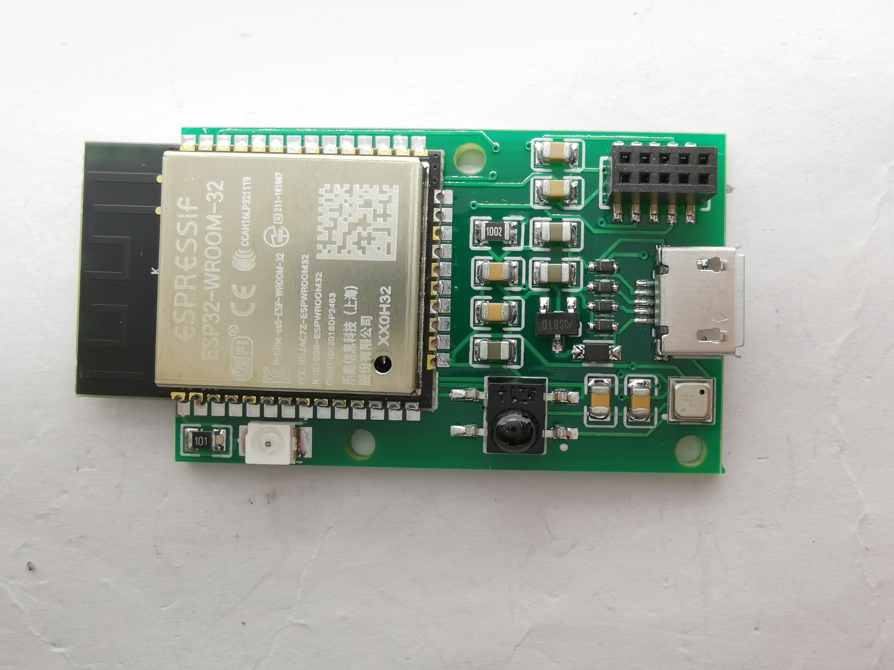
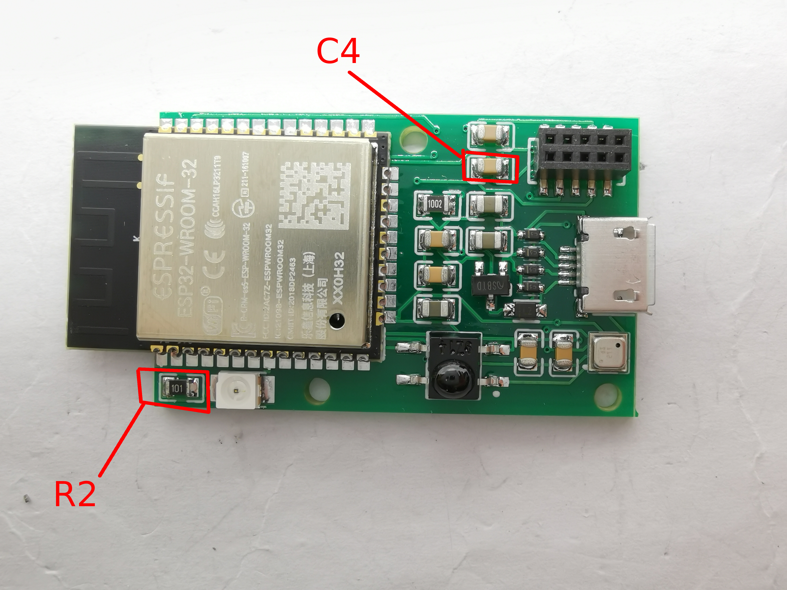

# ESPHome_IR_bme680
Simple board based on ESP32 that provides IR RX, TX and bme680 for ESPHome.io (and Home-Assistant.io)

# Buy the board
I currently do not sell it however you can have it made at pcbway here: [PCBWAY](https://www.pcbway.com/project/shareproject/tttttx2_ESPHome_IR_bme680.html)

Feel free to use any other factory you wish, required files are in the repo.

# Flashing
Create the firmware on ESPHome using the sample configuration [here](ESPHome_example.yaml)
Flash initial ESPHome Firmware using esptool or esphome flasher. This board has no built in programmer so you need to hook it up to the pin headers (no USB programming!) for serial programming. The Pinout is like this:

|Pin|Funciton|
|---|--------|
| 1 | TX  |
| 2 | RX  |
| 3 | EN  |
| 4 | IO0 |
| 5 | GND |
| 6 | 3.3V|
| 7 | GND |
| 8 | 5V  |
| 9 | NC  |
| 10| NC  |

I recommend just hooking up RX/TX/GND and 3.3V. Keeip in mind that ESP32 max tolerated voltage is 3.3V! 

After successful Flashing please remove C4 to allow the chip to boot. 

# Troubleshooting 
## IR too weak
Remove R2 and bridge the connection. This way you allow more current through the IR LED and it will emit a stronger beam of light. Still you need to align it somewhat with the device you try to control.

## Temperature is wrong
You need to calibrate the sensor. Look it up [here](https://esphome.io/components/sensor/index.html#sensor-filters)

## Doesn't boot after flashing
You need to remove C4

## Where is C4 or R2?

